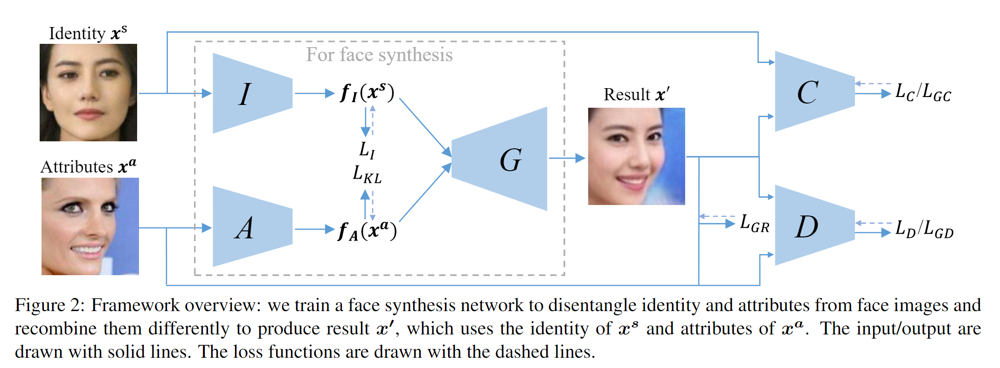
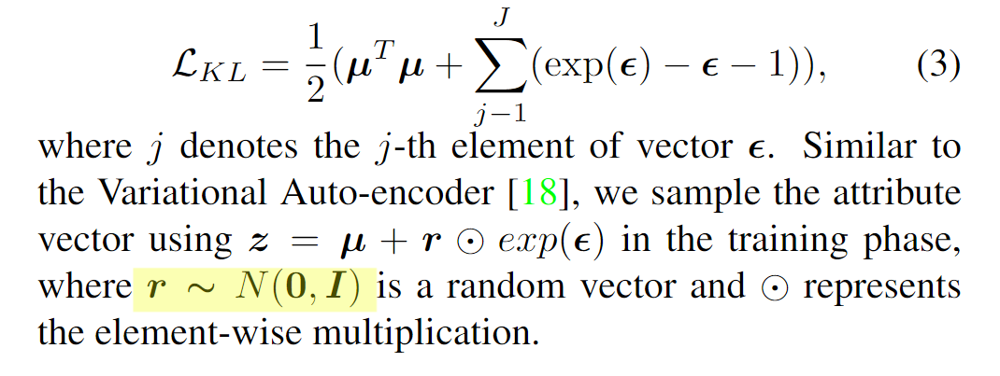
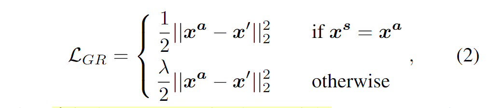
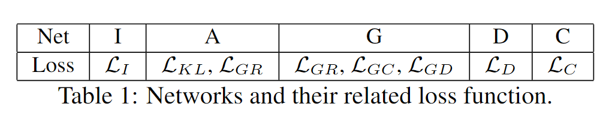
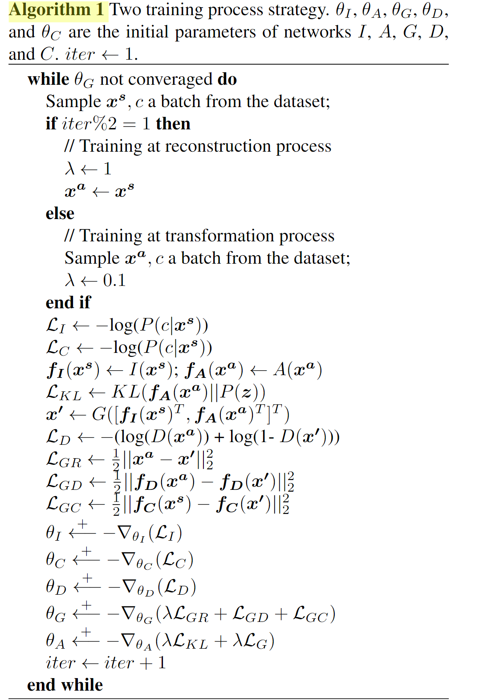

# Towards Open-Set Identity Preserving Face Synthesis

## I. 核心思想

1. 从**I**dentity image中提取出identity feature（长相）
2.  从**A**ttitude image中提取出attribute feature（光照，角度，风格, etc.）
3. 使用**G**enerate network，输入这两种特征，得到混合了identity和attribute的图像（换脸图）
4. 利用**D**iscriminate network和**C**lassification Network作为辅助，使得融合的图像更真实

**重点**：identity和attribute要高度区分开，融合时要同时保留两边的特征

## II. 关键点

1. **KL loss** ($L_{KL}$)：使A生成的attribute vector近似于标准正态分布$N(0,1)$，从而减少attribute中的identity信息（Chap 4.2的实验验证）（参考[VAE encoder](https://zhuanlan.zhihu.com/p/27549418)）
2. **Reconstruction loss** ($L_{GR}$)：当identity和attribute图片相同时，鼓励生成的图像与原始图像相同；当identity和attribute图片不同时，鼓励合成图像与attribute更相似。这个loss是为了更多的保存attibute信息 
3. **Asymmetric Loss** ($L_{GC}$& ($L_{GD}$))：在D中和C中加入对称的loss：C中鼓励identity图像和synthesis图像在最后一个FC的输出接近；D中鼓励attribute图像和synthesis图像在最后一个FC的输出接近。这两个对称的loss时为了同时保留两种特征，并且真实地融合

## III. 具体结构

#### 1. Network I（Identity）

- 结构：VGG
- 输入：{ Identity image $x_s$ , Idendtity annotation $c_i$ }
- 训练方式：使用softmax loss $L_I$，当作分类问题训练（无annotation时不更新）
- 输出：分类结果
- 特征：把最后一个pooling层的输出作为identity vector $f_I(x_s)$

#### 2. Network A（Attribute）

- 结构：VGG[(VAE encoder](https://zhuanlan.zhihu.com/p/27549418))

- 输入：Attribute image $x_a$

- 训练方式：使用KL loss $L_{KL}$促使A输出的vector中包含更少的identity信息（更好的提取attribute）；使用reconstruction loss $L_{GR}$促使A学到不同的attribute representation

- 超参数：$\lambda = 0.1(x_s\neq x_a)$

- 输出：均值向量$\mu$和标准差向量$\epsilon$

- 特征：根据公式
  $$
  z=\mu+r\odot \exp(\epsilon),r\sim N(0,1)
  $$
  用一个符合标准正态分布的随机噪声$z$先乘上标准差$\epsilon$, 再加上均值$\mu$ 就得到了服从正态分布attribute vector $f_A(x_a)$

#### 3. Network G（Generate）

- 结构：inverse VGG
- 输入：identity和attribute vector的结合 $[f_I(x_s)^T, f_A(x_a)^T]^T$
- 训练方式：reconstruction loss $L_{GR}$使G生成的图像保留尽可能多的attribute信息；asymmetry loss $L_{GC}, L_{GD}$使G生成的图像更好的结合两种特征
- 输出：合成图像$x\prime$

#### 4. Network D（Discriminate）

- 结构：[DCGAN](https://pytorch.org/tutorials/beginner/dcgan_faces_tutorial.html)中的D
- 输入：{ 合成图像$x\prime$，Attribute image $x_a$ }
- 训练方式：discriminate loss $L_D$ (2分类：真/假)

#### 5. Network C（Classification）

- 结构：VGG（与I共享参数）
- 输入：{ 合成图像$x\prime$，  Identity image $x_s$， Idendtity annotation $c_i$}
- 训练方式：同I，无annotation时不更新

这个表里总结了每个网络是被哪些loss训练的

## 4. 训练方法

一次reconstruction process（identity == attribute），一次transformation process （identity != attribute)

