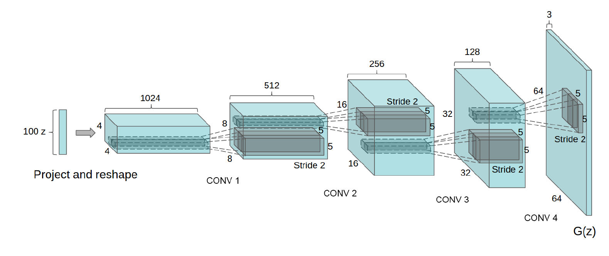

# Deep Convolutional Generative Adversarial Networks

## I. Code

- [carpedm20/DCGAN-tensorflow](https://github.com/carpedm20/DCGAN-tensorflow/blob/master/model.py)
- [DCGAN-pyTorch](https://pytorch.org/tutorials/beginner/dcgan_faces_tutorial.html)

## II. Architecture guidelines

- Replace any pooling layers with **strided convolution**s (discriminator) and fractional-strided
  convolutions (generator).
-  Use **batchnorm** in both the generator and the discriminator.
-  **Remove fully connected** hidden layers for deeper architectures.
-  Use **ReLU** activation in generator for all layers except for the output, which uses **Tanh.**
-  Use **LeakyReLU** activation in the discriminator for all layers.

## III. Training details

- Pre-processing: scaling images to the range of the tanh activation function [-1, 1]. 
- mini-batch stochastic gradient descent (SGD) with a mini-batch size of 128.
- All weights were initialized from a zero-centered Normal distribution with standard deviation 0.02. 
- LeakyReLU, the slope of the leak was set to 0.2 
- Adam optimizer with tuned hyperparameters, Momentum term 0.5
- Learning rate using 0.0002

## IV. Architecture

DCGAN：

- G：100-d z -> fc -> reshape -> {deconv+batchNorm+RELU}(4) -> tanh -> 64x64
- D:
  - v1：{conv+batchNorm+leakyRELU} (4) -> reshape -> fc  -> sigmoid
  - v2：{conv+batchNorm+leakyRELU} (4) -> reshape -> fc  -> softmax